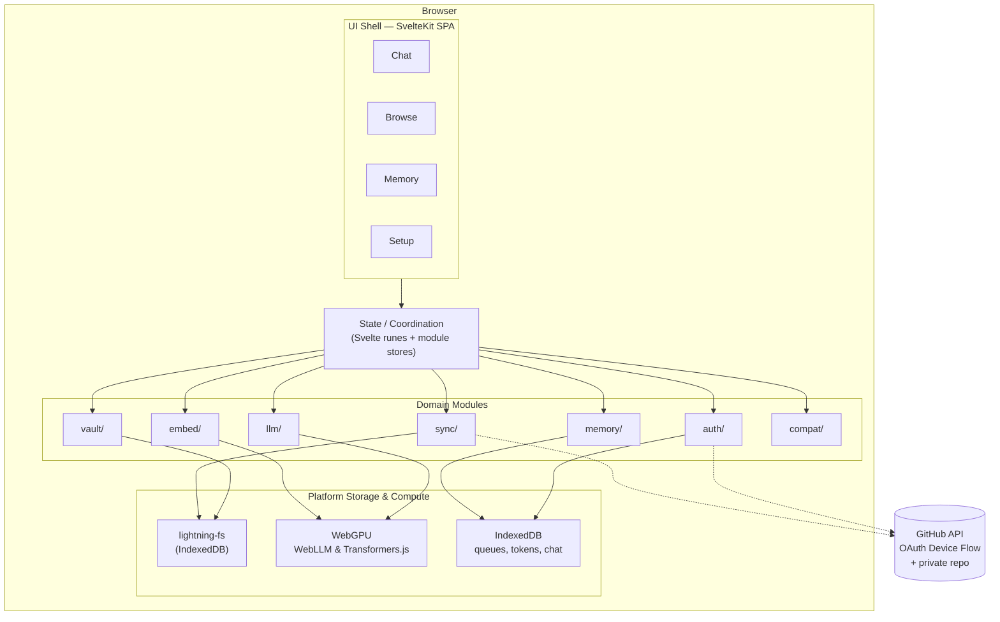
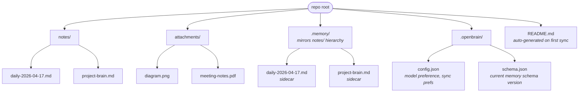
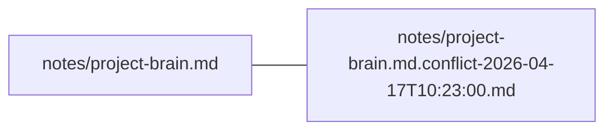
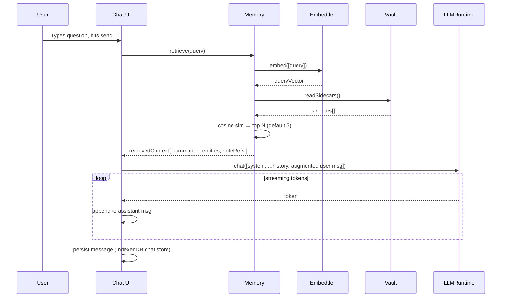
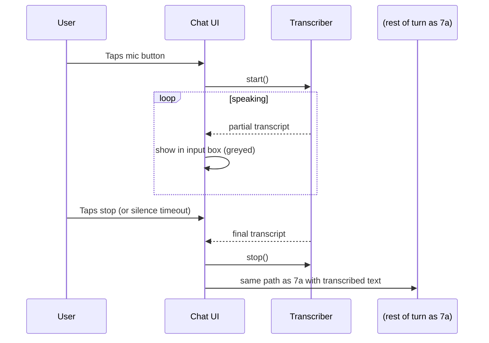
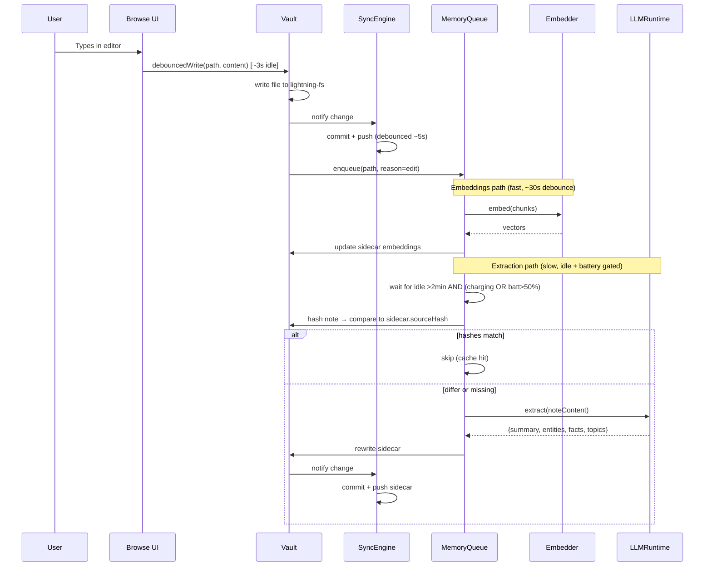
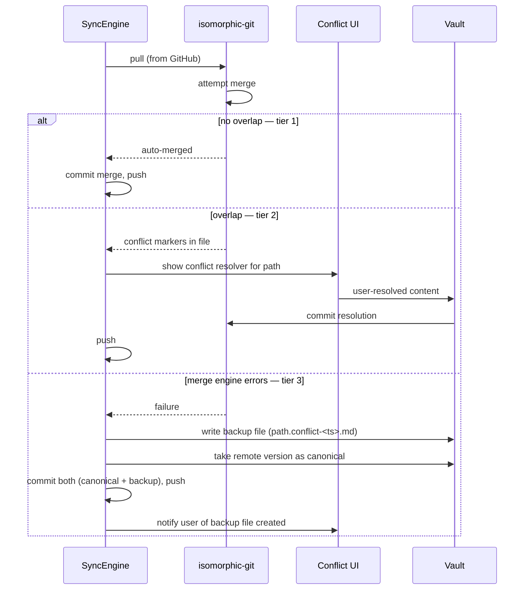
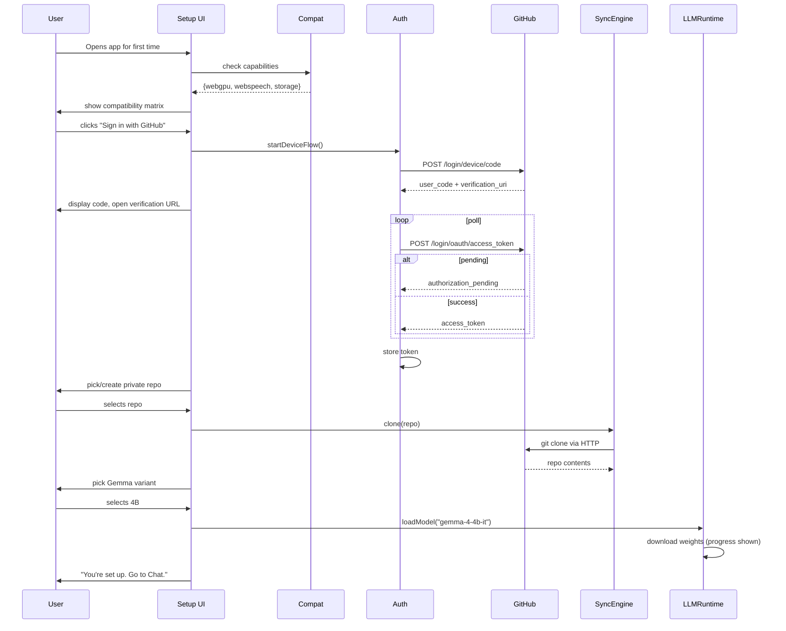
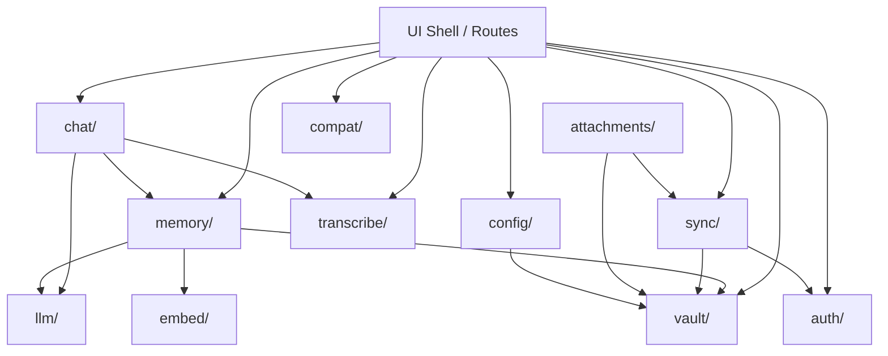

# Open Brain — Architecture Sketch

**Date:** 2026-04-17
**Status:** First sketch, pre-implementation
**References:** [CONSTRAINTS-2026-04-17.md](./CONSTRAINTS-2026-04-17.md), [TECH-STACK-2026-04-17.md](./TECH-STACK-2026-04-17.md)

---

## 1. High-Level Picture



---

## 2. Module Map

| Module | Responsibility | Key Dependencies |
|---|---|---|
| **`auth/`** | GitHub Device Flow; token storage; current user info | GitHub API |
| **`vault/`** | Read/write notes + sidecars; path conventions; markdown+frontmatter parsing; wikilink extraction | `isomorphic-git/lightning-fs` |
| **`sync/`** | Clone/pull/push/merge; conflict detection & resolution tiers; debounced auto-sync | `isomorphic-git`, `vault`, `auth` |
| **`attachments/`** | `AttachmentStore` interface; `GitHubRepoAttachments` MVP impl | `vault`, `sync` |
| **`transcribe/`** | `Transcriber` interface; `WebSpeechTranscriber` MVP impl | Web Speech API |
| **`llm/`** | `LLMRuntime` wrapper around WebLLM; streaming; model download/swap; VRAM coordination | `@mlc-ai/web-llm` |
| **`embed/`** | `Embedder` wrapper around Transformers.js; batch embedding | `@xenova/transformers` |
| **`memory/`** | Sidecar read/write; hash invalidation; embedding queue; LLM extraction queue; retrieval | `vault`, `embed`, `llm` |
| **`chat/`** | Chat session state; message history; orchestrates retrieval + LLM turn | `memory`, `llm`, `transcribe` |
| **`compat/`** | Detect WebGPU, Web Speech API, OPFS, storage quota; expose capability flags | platform APIs |
| **`config/`** | User preferences (model variant, sync repo, dark mode) persisted to IndexedDB and to `.openbrain/config.json` in the repo | `vault` |
| **`ui/`** | Svelte components, routes, layout | all of the above |

Each module exports a narrow, testable API. UI does not reach past the module boundary.

---

## 3. Data Models

Sketched in TypeScript style for clarity. Actual code may diverge.

```ts
// vault
type NotePath = string;   // POSIX-style, relative to repo root, e.g. "notes/project.md"

interface Note {
  path: NotePath;
  content: string;          // full markdown body (frontmatter excluded)
  frontmatter: Record<string, unknown>;
  lastModified: number;     // ms epoch
}

interface WikilinkRef {
  from: NotePath;
  to: NotePath | string;    // may be unresolved
  display?: string;         // [[target|display]]
}

// memory
interface Sidecar {
  source: NotePath;
  sourceHash: string;       // sha256 of source file contents
  extractedAt: number;
  model: string;            // e.g. "gemma-4-4b-it"
  schemaVersion: number;

  summary: string;
  entities: Entity[];
  facts: string[];
  topics: string[];
  links: WikilinkRef[];

  embeddings: EmbeddingChunk[];  // inline in frontmatter as base64
}

interface Entity { type: string; name: string; }

interface EmbeddingChunk {
  chunkIndex: number;
  text: string;
  vector: Float32Array;     // 384 dims for all-MiniLM-L6-v2
}

// chat
type Role = "user" | "assistant" | "system";

interface ChatMessage {
  id: string;
  role: Role;
  content: string;
  timestamp: number;
  retrievedContext?: NotePath[];   // which notes informed this turn
}

// sync
type SyncStatus =
  | { kind: "idle" }
  | { kind: "syncing"; phase: "commit" | "push" | "pull" | "merge" }
  | { kind: "conflict"; paths: NotePath[] }
  | { kind: "error"; message: string };
```

---

## 4. Repo Storage Layout

Laid out in the user's GitHub repo and mirrored in lightning-fs:



Conflict backups (tier 3 of resolution) land next to their source, e.g.:



---

## 5. Browser Storage Layout

Beyond the git working copy, we have a few separate IndexedDB stores:

| Store | Purpose |
|---|---|
| `openbrain-fs` | lightning-fs backing store (all repo files) |
| `openbrain-auth` | OAuth token + GitHub user info |
| `openbrain-queues` | Pending embedding jobs, pending LLM extraction jobs, retry state |
| `openbrain-chat` | Chat history (not synced to repo — ephemeral per device) |
| `openbrain-cache` | Transient UI state: last opened note, scroll positions |
| WebLLM's own store | Model weights (managed by `@mlc-ai/web-llm`) |
| Transformers.js cache | Embedding model weights |

**Chat history note:** not synced by default. Open question (filed in constraints §13 as adjacent to the "AI introspects memory" question) whether chat history should be synced — skipped for MVP because (a) it's noisy, (b) it inflates repo size, (c) privacy-conscious users may prefer it stay device-local.

---

## 6. Key Abstractions (Interfaces)

### `Transcriber`
```ts
interface Transcriber {
  isAvailable(): boolean;
  start(): AsyncIterable<TranscriptEvent>;   // streams partial + final results
  stop(): Promise<void>;
}

type TranscriptEvent =
  | { kind: "partial"; text: string }
  | { kind: "final"; text: string }
  | { kind: "error"; message: string };
```
MVP: `WebSpeechTranscriber`. Future: `WhisperTranscriber`.

### `AttachmentStore`
```ts
interface AttachmentStore {
  put(id: string, blob: Blob): Promise<AttachmentRef>;
  get(ref: AttachmentRef): Promise<Blob>;
  delete(ref: AttachmentRef): Promise<void>;
}

interface AttachmentRef {
  provider: "github-repo" | "dropbox" | "s3";
  path: string;            // provider-scoped location
}
```
MVP: `GitHubRepoAttachments` (writes under `attachments/`).

### `LLMRuntime`
```ts
interface LLMRuntime {
  loadModel(id: GemmaVariant, onProgress: (p: LoadProgress) => void): Promise<void>;
  unloadModel(): Promise<void>;
  chat(messages: ChatMessage[], opts: ChatOptions): AsyncIterable<string>;  // token stream
  currentVariant(): GemmaVariant | null;
}
```

### `Embedder`
```ts
interface Embedder {
  embed(texts: string[]): Promise<Float32Array[]>;
}
```

These interfaces are what the rest of the app depends on. Concrete implementations live behind them.

---

## 7. Sequence Diagrams

### 7a. Chat turn (text input)



### 7b. Chat turn (voice input)



### 7c. Edit → sync → memory refresh



### 7d. Conflict resolution (three-tier)



### 7e. First-run setup



---

## 8. Module Dependency Graph



No cycles. `vault` is the most depended-on module; it stays pure (no network, no LLM, no UI).

---

## 9. Concurrency & Coordination

A few real constraints force coordination between modules:

### VRAM / memory pressure
- WebLLM holds the Gemma weights in GPU memory.
- Transformers.js also uses WebGPU when available.
- On a 4 GB-VRAM device loading Gemma-4B, embedding-in-parallel can OOM.
- **Strategy:** `LLMRuntime` and `Embedder` share a **`GpuLease`** single-slot lock. When LLM is streaming a chat turn, embedding jobs in the queue wait. When idle, embeddings run freely.
- Small models (Gemma-1B) with headroom can skip the lock — `GpuLease` detects available VRAM via WebGPU limits.

### Sync coalescing
- Rapid edits cause many file writes. We don't want one commit per keystroke.
- `SyncEngine` debounces commits (~5s idle) and batches all changed files into a single commit.
- Sidecar rewrites arriving from the memory queue piggyback onto the next commit window when possible.

### Network awareness
- Sync pauses (without error) when offline. UI shows a pending-sync badge. Resumes when back online.
- Model downloads pause/resume similarly (WebLLM handles this internally).

### Battery awareness (mobile)
- Memory extraction queue reads `navigator.getBattery()` and pauses LLM extraction when battery < 50% and not charging.
- Embedding (cheap) is not gated on battery.

---

## 10. Retrieval Algorithm (concrete)

For each chat turn:

1. **Embed the query** (Embedder, ~50ms on mobile).
2. **Load sidecars** from `.memory/` via Vault. Sidecars are small — typical size ~2–10 KB.
3. **Cosine similarity** of query vector against each chunk vector across all sidecars.
4. **Rank and select top-K chunks** (default K=5, user-tunable post-MVP).
5. **Assemble context:**
   ```
   System: You are the user's second brain. Answer using the provided notes.
   Context:
     - [summary from note A]
     - [matched chunk from note B with [[wikilink]] preserved]
     - ...
   User: <original query>
   ```
6. **Hand to LLMRuntime.chat()** and stream tokens to UI.
7. **Record `retrievedContext: NotePath[]`** on the assistant message for transparency (UI can show "based on: note A, note B").

**Context budget:** target ~70% of Gemma's context window for retrieved content, leaving ~30% for history + response. Drop lowest-scoring chunks first if overflow.

---

## 11. Build & Deploy

- `npm run build` → static output in `build/`.
- Deploy target: **Cloudflare Pages** (recommendation, not locked). Alternatives: Netlify, GitHub Pages.
- No environment variables at build time — app is pure static, all runtime config happens in the browser against the user's own GitHub.
- CI: Vitest + Playwright on push; Lighthouse PWA audit on main.

---

## 12. Known Architectural Risks

1. **iOS Safari gap.** No WebGPU → no local LLM. Browse + sync will still work; Chat tab must degrade gracefully with a clear message on the compat page.
2. **Large repos.** Cloning a 1000-note repo into lightning-fs is fine; a 50 000-note repo may hit IndexedDB quota issues. Out of scope for MVP but worth measuring once real users exist.
3. **Model-switch invalidates some memory.** Changing from Gemma-4B to Gemma-1B doesn't invalidate sidecars (the extraction output is the same shape), but quality changes. `model:` field on sidecars lets us surface this ("extracted with a smaller model; consider re-running").
4. **Token storage.** IndexedDB is origin-isolated but not encrypted at rest. XSS is the main threat; CSP + no third-party JS is our mitigation. WebAuthn-based encryption is a post-MVP hardening step.
5. **WebLLM Gemma 4 support.** Assumed based on WebLLM's track record of shipping new Gemma variants quickly. Verify during first spike.

---

## 13. What's intentionally _not_ in this sketch

- **Error taxonomy** — covered once we build. Keep errors typed at module boundaries.
- **Exact Tailwind theme tokens** — UI design phase.
- **Keyboard shortcuts** — UX phase.
- **Onboarding copy** — content phase.
- **Specific chunking algorithm for embeddings** — will be validated empirically (paragraph-split vs. fixed-window vs. markdown-section-aware). Default plan: split on `##` headings with a 400-token fallback cap.

---

## 14. Next steps

1. Validate this sketch end-to-end with a **walking skeleton**:
   - SvelteKit SPA shell with three routes
   - Device-flow auth against a throwaway GitHub App
   - Clone a test repo into lightning-fs
   - Load Gemma-1B in WebLLM (smallest viable)
   - Embed one string with Transformers.js
   - Everything visible in the UI with zero styling
2. If skeleton works, proceed to module-by-module implementation in the order of the dependency graph (Vault first, UI last).
3. If skeleton blocks on anything, revise this doc before implementing.
